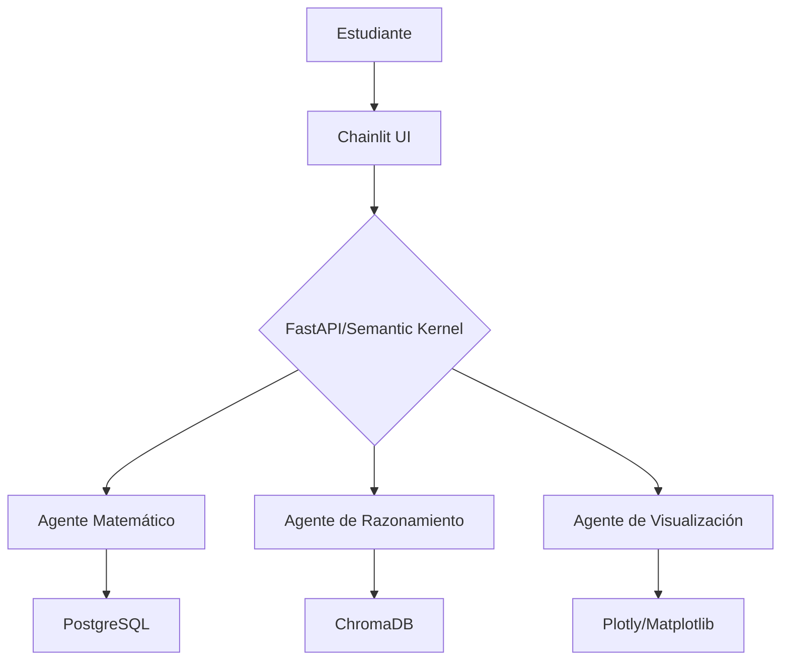

# Lixwi AI - Plan de Proyecto

## Visión General
**Propósito**: Plataforma educativa STEM con tutoría basada en agentes AI, comenzando con matemáticas y escalable a física/química.  
**Principios Guía**: 
- ✨ **Explicabilidad**: Todas las respuestas incluyen fuentes y razonamientos.
- 📈 **Adaptabilidad**: Dificultad ajustada al progreso del estudiante.
- 🔒 **Ética**: Cumplimiento con Responsible AI (Fairlearn, Presidio).

---

## Arquitectura Técnica

### Componentes Clave
Módulo  |   Tecnología  |   Responsabilidad
---|---|---
Orquestación    |   Semantic Kernel |   Coordinar agentes y flujos de trabajo
Base de Conocimiento |   ChromaDB + Pinecone |   Búsqueda semántica de libros/papers
Almacenamiento    |   Neon.tech (PostgreSQL) |   Historial de estudiantes y progreso
Frontend         |   Chainlit |   Interfaz conversacional con Latex/gráficos

### Equipo y Roles
Rol |   Responsabilidades   |   Herramientas
---|---|---
Tech Lead	|	Arquitectura SK, integración APIs	|   Python, Azure, Docker
LLM Engineer	|	Fine-tuning GPT-4, prompts educativos	|   OpenAI API, Hugging Face
Backend Dev	|	Desarrollo de plugins (SymPy/Wolfram)	|   FastAPI, Redis
Frontend Dev	|	UI educativa en Chainlit	|   CSS, Plotly, Latex
Data Engineer	|	Bases de datos y monitoreo	|   PostgreSQL, Prometheus

## Roadmap (Sprints de 2 Semanas)
### Sprint 1: MVP Matemático Básico
Objetivo : Tutoría de álgebra lineal

Entregables :

- Plugin MathSolver en Semantic Kernel
- Chainlit con renderizado de Latex
- Conexión a Neon.tech (PostgreSQL)
### Sprint 2: Evaluación Adaptativa
Objetivo : Personalizar dificultad según el usuario

Entregables :

- Sistema de niveles de dificultad
- Dashboard de progreso (Grafana)
- Integración Fairlearn para sesgos

### Sprint 3: Física/Química
Objetivo : Escalar a nuevas disciplinas

Entregables :

- Plugin `PhysicsSolver` (simulaciones)
- Gráficos 3D interactivos
- RAG con papers de arXiv
### Sprint 4: Escala Empresarial
Objetivo : Preparar para despliegue masivo

Entregables :

- Kubernetes en Azure/AWS
- Migrar a Azure AI Search (vectores)
- Autenticación con Azure AD

## Métricas Clave
Categoría | Métrica |   Objetivo
---|---|---
Educación | Tasa de finalización | > 70% en 3 meses
Rendimiento | Latencia promedio por consulta | < 1.5 segundos
Costos | Costo por 1k usuarios/mes | < $500
Calidad | Puntuación NPS | > 8.5/10

## Riesgos y Mitigación
Riesgo | Mitigación
---|---
Sesgos en datos de entrenamiento | Revisión manual de datasets
Alta latencia con LLM | Cache agresivo en Redis + modelos locales (ej: Llama 3 quantizado)
Escalabilidad de ChromaDB | Plan de migración a Pinecone/Azure AI Search (vectores escalables)

## Enlaces Útiles
- Documentación Semantic Kernel
- Neon.tech (PostgreSQL Free Tier)
- Guía Chainlit para Educación